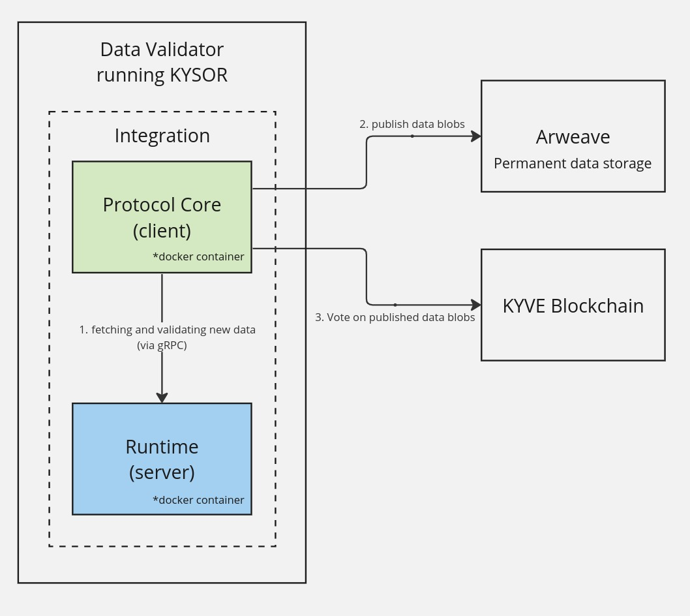

<div align="center">
  <h1>@kyvejs</h1>
</div>


<p align="center">
<strong>Tools for building applications on KYVE</strong>
</p>

<br/>

<div align="center">
  

  

  

  
</div>

<div align="center">
  <a href="https://twitter.com/KYVENetwork" target="_blank">
    
  </a>
  <a href="https://discord.com/invite/kyve" target="_blank">
    
  </a>
  <a href="https://t.me/kyvenet" target="_blank">
    
  </a>
</div>

<br/>

KYVE, a protocol that enables data providers to standardize, validate, and permanently store blockchain data streams, is a solution for Web3 data lakes. 
For more information check out the [KYVE documentation](https://docs.kyve.network/).

## Project Overview

**Common:**

- common/goutils - go utility functions for this repository
- common/proto - protocol buffer definitions for this repository

**Protocol:**

- [protocol/core](protocol/core/README.md) - core functionality for running validators on the KYVE network

**Runtime:**

- [runtime/tendermint](runtime/tendermint/README.md) - The official KYVE Tendermint sync runtime
- [runtime/tendermint-ssync](runtime/tendermint-ssync/README.md) - The official KYVE Tendermint state-sync runtime
- [runtime/tendermint-bsync](runtime/tendermint-bsync/README.md) - The official KYVE Tendermint block sync runtime

**Tools:**

- [tools/kysor](tools/kysor/README.md) - The Cosmovisor of KYVE
- [tools/kystrap](tools/kystrap/README.md) - A bootstrap tool for creating new KYVE runtimes

**Test**
- test/e2e - end-to-end tests for the KYVE protocol and runtimes

## What is a KYVE integration?
A KYVE data validator requires an integration to validate and store data. 

An integration consists of the protocol core (client) and the runtime (server).<br>
The protocol core is responsible to communicate between the KYVE blockchain and the runtime and store data blobs on a storage provider (Arweave).



## How to write a KYVE runtime

You can choose to write a runtime in Go, Python, or TypeScript. The following steps will guide you through the process of creating a new runtime.

**Prerequisites:**
- [Docker](https://docs.docker.com/engine/install/)

**Step 1:** Clone the repository and checkout a new branch
```bash
git clone git@github.com:KYVENetwork/kyve-rdk.git

# Checkout a new branch
# git checkout -b [feat/fix]/runtime/[my-branch-name]
git checkout -b feat/runtime/fancypants
```

**Step 2:** Run kystrap
```bash
make bootstrap-runtime
```

Follow the instructions to create a new runtime.
The wizard will create a new folder in `runtime/` with the name you provided.

The new runtime will contain a `README.md` with further instructions on how to get started.

**NOTE**: The usage of [Conventional Commits](https://conventionalcommits.org) is required when creating PRs and committing to this repository

## How to release

New releases are created by merging changes into the `main` branch and running the release script.
```bash
make release
```
This creates a release.sh script which can be modified before running it.<br>
After running the script the CI/CD pipeline will be triggered and the new releases will be created.
